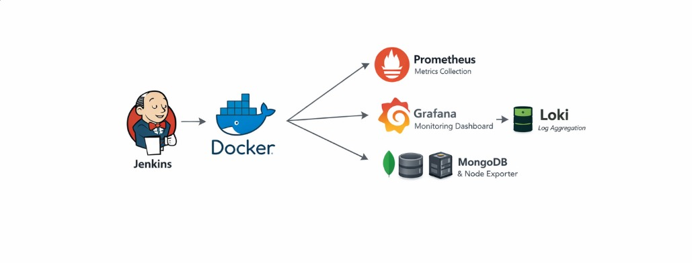
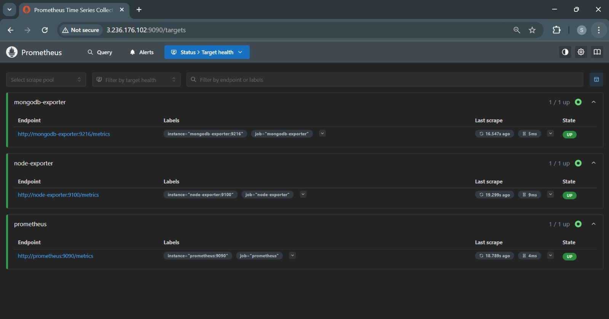
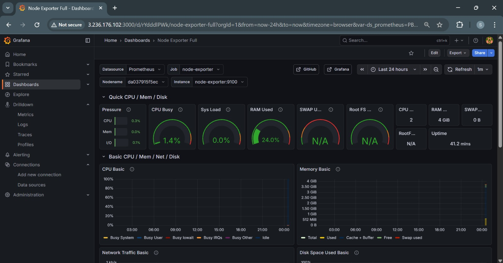

# 🚀 Docker Monitoring Tool – Jenkins-Driven Observability Stack

> **One-click monitoring setup using Jenkins, Docker, and Docker Compose**  
> Plug it into any server, run the pipeline, and your full monitoring stack is live.

---

## 📌 Overview

This repository provides a **production-ready Docker monitoring setup** that can be deployed **automatically using Jenkins** or **manually using Docker Compose**.

The idea is simple:
- Install **Jenkins** on any server (local / EC2 / VM / bare-metal)
- Configure required plugins and credentials
- Create a pipeline using the provided **Jenkinsfile**
- Run the pipeline 🚀

That’s it.

The pipeline:
- Pulls this repository
- Deploys all monitoring containers
- Auto-configures Prometheus as a Grafana data source
- Starts collecting **server metrics, container metrics, MongoDB metrics, and logs**

Within minutes, you’ll have a **fully functional observability stack** running.

---

## 🧠 Why This Project?

Monitoring is often taught in pieces — Prometheus here, Grafana there, exporters somewhere else.

This project focuses on:
- **End-to-end monitoring**
- **Real-world DevOps workflow** using Jenkins
- **Zero-manual configuration** after deployment
- Helping beginners and intermediate engineers understand how a **complete monitoring system works together**

---

## 🏗️ Architecture


```text
Jenkins Pipeline
      │
      ▼
Docker Compose
      │
      ├── Prometheus
      ├── Grafana
      ├── Node Exporter
      ├── MongoDB
      ├── MongoDB Exporter
      └── Loki


```



## 📦 Components Included

| Component | Purpose |
|---------|--------|
| Prometheus | Collects and stores metrics |
| Grafana | Visualizes metrics & dashboards |
| Node Exporter | Server / VM health metrics |
| MongoDB | Sample database workload |
| MongoDB Exporter | MongoDB performance metrics |
| Loki | Centralized container logs |

---

## ✨ Key Features

- Jenkins-driven deployment (CI/CD style)
- Works on **local machine, EC2, or any Linux server**
- Zero manual Grafana configuration
- Auto-linked Prometheus datasource
- Server health dashboards ready to use
- MongoDB health & performance monitoring
- Log aggregation with Loki
- Beginner-friendly and interview-ready project

---

## 🔧 Prerequisites

### Server Requirements
- Linux server (Local / VM / EC2)
- Docker installed
- Docker Compose installed

### Jenkins Requirements
- Jenkins installed
- Jenkins user added to Docker group

```bash
sudo usermod -aG docker jenkins
sudo systemctl restart jenkins
```

## 🔌 Jenkins Plugins Required

Install the following Jenkins plugins before running the pipeline:

- **Git**
- **Pipeline**
- **Docker Pipeline**
- **Credentials Binding**

You can install these from:  
**Jenkins Dashboard → Manage Jenkins → Plugins**

---

## 🔐 Jenkins Credentials Setup

1. Go to **Jenkins Dashboard → Manage Jenkins → Credentials**
2. Add new credentials:
   - Kind: **Username with password** or **Secret text**
   - Username: **GitHub username**
   - Password / Secret: **GitHub Personal Access Token**
3. Save the credentials and note the **Credentials ID**
4. Use this credentials ID inside the `Jenkinsfile`

---

## ▶️ Deployment Using Jenkins (Recommended)

### Step 1: Create a New Pipeline

- Open **Jenkins Dashboard**
- Click **New Item**
- Enter a pipeline name
- Select **Pipeline**
- Click **OK**

---

### Step 2: Configure Pipeline

Configure the pipeline with the following settings:

- **Pipeline definition**: Pipeline script from SCM  
- **SCM**: Git  
- **Repository URL**: `<your-repository-url>`  
- **Credentials**: `<your-git-credentials>`  
- **Branch**: `main` (or your default branch)  
- **Script Path**: `Jenkinsfile`

Save the configuration.

---

### Step 3: Run the Pipeline

Click **Build Now** 🎯

The Jenkins pipeline will automatically:

- Clone the repository
- Pull required Docker images
- Deploy all monitoring containers using Docker Compose
- Start Prometheus, Grafana, Node Exporter, MongoDB, MongoDB Exporter, and Loki
- Auto-configure Prometheus as a Grafana datasource

Within minutes, the monitoring stack will be live.

---

## 🐳 Manual Deployment (Without Jenkins)

You can also run the project manually without Jenkins:

```bash
git clone https://github.com/SambhavSinghChouhan/Docker-Monitoring-Tools.git
cd Docker-Monitoring-Tools
docker compose up -d
```
This is useful for:
- Local testing
- Learning Docker Compose
- Understanding monitoring components

---

## 📊 Accessing the Services

| Service     | URL |
|------------|-----|
| Grafana    | http://<server-ip>:3000 |
| Prometheus | http://<server-ip>:9090 |




### Default Grafana Credentials
- Username: admin
- Password: admin


You’ll be prompted to change the password on first login.

---

## 📈 Dashboards & Metrics

Grafana dashboards include:
- Server CPU, memory, disk, and network usage
- Container-level metrics
- MongoDB performance metrics (connections, operations, memory usage)




---

## 🧾 Logs with Loki

- Loki automatically collects logs from all running containers
- Logs can be queried directly from Grafana using the **Explore** section
- Useful for debugging and correlating logs with metrics

<!-- IMAGE: Add Grafana Loki logs screenshot here -->

---

## 📂 Repository Structure


```text
.
├── docker-compose.yml
├── Jenkinsfile
├── prometheus/
│   └── prometheus.yml
├── grafana/
│   └── provisioning/
│       └── datasources/
│           └── prometheus.yml
├── loki/
│   └── loki-config.yml
└── README.md
```

---

## 🎯 Learning Outcomes

By using this repository, you will understand:
- How real-world monitoring stacks are built
- Jenkins-based infrastructure automation
- Prometheus scraping and exporters
- Grafana provisioning and dashboards
- Log aggregation using Loki
- Docker Compose orchestration

---

## 🧪 Use Cases

- DevOps learning project
- Interview demonstration
- Internal monitoring proof of concept (POC)
- CI/CD + Observability practice
- Beginner-friendly production-style setup

---

## 🛡️ Production Notes

This project is designed for **learning and POC purposes**.

For production environments:
- Secure Grafana with proper authentication
- Use persistent Docker volumes
- Configure alerting with Alertmanager
- Harden Docker and Jenkins security

---

## 🤝 Contributing

Contributions are welcome!
1. Fork the repository
2. Create a feature branch
3. Submit a pull request

---

## 👨‍💻 Author

**Sambhav Singh Chouhan**  
DevOps | Cloud | Monitoring Enthusiast

---

⭐ If this project helped you learn monitoring, give it a star!
